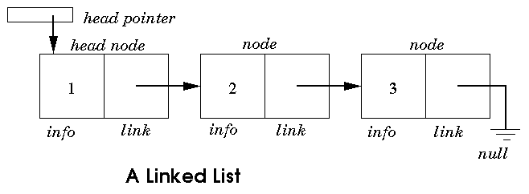
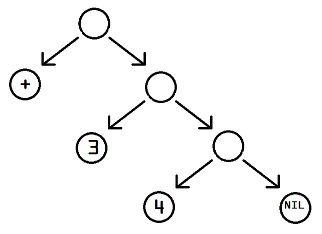
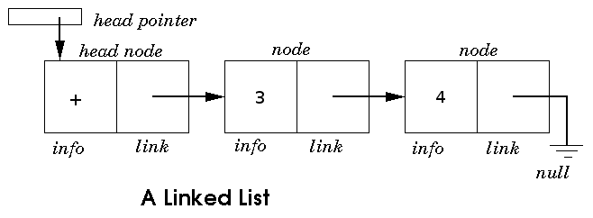
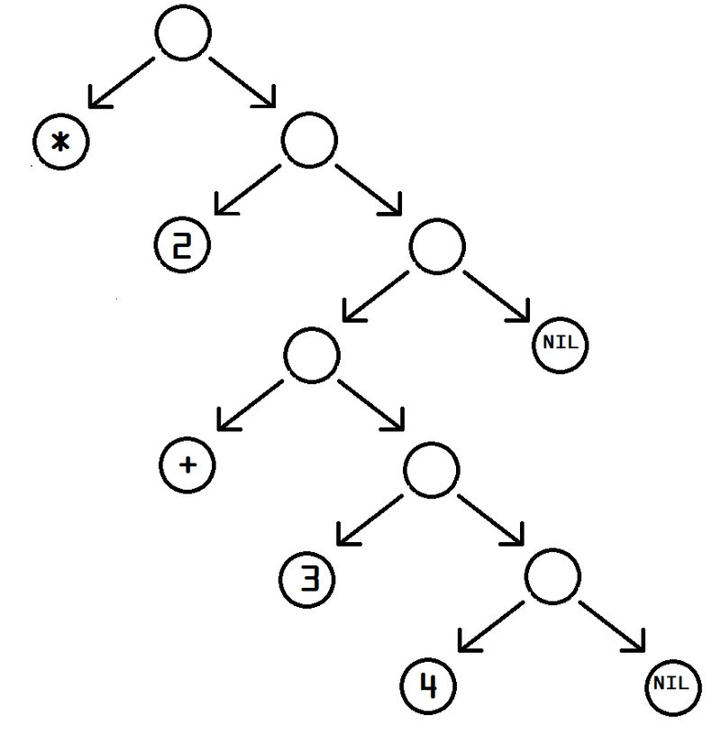

<!-- $theme: gaia
 template: gaia
 -->

# ClojureBridge New York City
## New York, NY
## June 02 - 04, 2017

---

# Basics

---

# The List

## Logic Theorist (1956)
### Allen Newell and Herbert Simon
### *Thinking Machine*

---

## :1234: Logic Theorist

- Generate mathematical proofs
    - Brute force
    - Heuristic solution
- Programmed by Cliff Shaw
- Discovery of the *linked list*
    - Flexible data structure
    - Recursive data structure

---

#  :link: The Linked List

## 

---

## :1234: Logic Theorist
### Result

- Proved 38 of the first 52 theorems in Whitehead and Russell's *Principia Mathematica*
- In some cases, found more elegant solutions

---

# S-expressions

## 

---

# S-expressions
## :link: Represented as a List

## 

---

# S-expressions

*Mathematical Expression* - a combination of symbols that are well-formed according to syntactical rules. An arithmetical expression: `3 + 4`

*Symbolic Expressions* - a combination of symbols that are well-formed according to the structure of a nested binary tree. Directly expressed in first-order logic `(+ 3 4)`

Clojure programs are composed of s-expressions.

---

# S-expressions

`(+ 3 4)`

- Represents a *syntax tree* as a list. It contains three atoms: `+`, `3`, `4`.
- Represents a *form* when evaluated by Clojure
    - A *symbol* for an addition function called `+`
    - Two numeric literals, `3` and `4`

<!-- If an expression needs to be compiled, it will be. There is no separate compilation step, nor any need to worry that a function you have defined is being interpreted. Clojure has no interpreter. -->

---

## Prefix Notation

### 

#### `(* 2 (+ 3 4))` vs `(2 * (3 + 4))`

---

# S-expressions
## Prefix Notation
### (Those Parentheses)

- The parentheses ensure there is a unique parse tree for each expression.
- "Unique readability"
- `(predicate argument)`

---

# S-expressions
## Forms

*Form* - any s-expression meant to be evaluated

    (+ 3 4)
    > 7

    (* 2 (+ 3 4))
    > 14

---

# Forms
## :1234: Scalars: Numbers

Numeric literals are forms. They evaluate to themselves:

`33`
`> 33`

---

# Forms
## :abcd: Scalars: Strings

A string is a form. It is denoted by quote marks, `" "`. They evaluate to themselves:

`"Hello World"`
`> "Hello World"`

---

# Forms
## :symbols: Scalars: Symbols

Symbols are forms. They evaluate to what they name:

`inc` is a symbol that names a function

&there4; Depending on the editor:
- `inc` &rArr; `#object[clojure.core/inc ...]`
- `inc`&rArr; `#function[clojure.core/inc]`

---

# Forms
## :page_facing_up: Documentation

- `doc` prints documentation for the form denoted by the symbol
- `(use 'clojure.repl)`
    - `(doc inc)` &rArr; `clojure.core/inc ...`
    - `(doc +)` &rArr; `clojure.core/+ ...`
    - `(doc 1)` &rArr; `ClassCastException java.lang.Long cannot be cast to clojure.lang.Symbol`

---

# Forms
## :page_facing_up: Documentation

Cheatsheet: https://clojure.org/api/cheatsheet

---

# Forms
## :symbols: Scalars: Java Symbols

Symbols that begin with a dot to a Java class:

`(.toUpperCase "ClojureBridge")` &rArr; `"CLOJUREBRIDGE"`

---

# Forms
## Collections: Lists

A list is also a form. It is denoted by parentheses, `( )`. If the first element is a *symbol*, it's evaluated:

`(inc 2)`
`> 3`

`(+)`
`> 0`

`(+ 2 1)`
`> 3`

---

# Forms and S-expressions Revisited

*Form* - any s-expression meant to be evaluated

- Scalar Form: `33` &rArr; `33`
- Collection Form: `(+ 3 4)` &rArr; `7`

---

# Forms and S-expressions Revisited
## Collection: `(1 2 3)`

- `(1 2 3)` &rArr; `ERROR`
    - This is data - a collection of numbers - not intended for evaluation
    - For example, there is no function called `1`

---

# Forms and S-expressions Revisited
## Collection: `(1 2 3)`

- `(list 1 2 3)` &rArr; `(1 2 3)`
    - This is code - a collection of symbols and literals - intended for evaluation
    - Calls `list` and returns a collection of numbers called a list

---

# Forms and S-expressions Revisited
## Unevaluated Form

`(quote (+ 1 2))`
`> (+ 1 2)`

`'(a b c)`
`> (a b c)`

---

# S-expressions
## Homoiconicity

S-expressions are used to represent **both** source **code** and **data**.

- A syntax tree is a **data** structure represented as a list, which can be evaluated as **code**
    - `(list '+ 1 2)` &rArr; `(+ 1 2)`
    - Evaluates to a list, which describes a function call

---

# S-expressions
## Homoiconicity

S-expressions are used to represent **both** source **code** and **data**.
- A form is **code** represented as a list, which can be evaluated to yield **data**
    - `(list 1 2 3)` &rArr; `(1 2 3)`
    - Evaluates to a list, which describes a collection

---

# Boolean
## Binary Predicates

- `(predicate argument)`
- Boolean forms
    - `(false? false)` &rArr; `true`
    - `(false? nil)` &rArr; `false`
    - `(nil? 0)` &rArr; `false`
    - `(true? ())` &rArr; `false`
    - `(zero? 0)` &rArr; `true`

---

# Boolean
## Special Form

- `(if test then else?)`
- Evaluates *test*

---

## Special Form

Special forms are:

- Symbols
- Only special when at the head of a list

---

# Boolean
## Conditionals

Branches based on the result of a form's evaluation

- `false` and `nil` are false
    - `(if nil "true" "false")` &rArr; `false`
    - `(if false "true" "false")` &rArr; `false`

---

# Boolean
## Conditionals

Branches based on the result of a form's evaluation

- `true` and everything else is true
    - `(if true "true" "false")` &rArr; `true`
    - `(if 88 "true" "false")` &rArr; `true`
    - `(if () "true" "false")` &rArr; `true`
- `(if (true? ()) "true" "false")` &rArr; `false`

---

# Conditionals
## `if`

`=`, `>`, `>=`, `<`, `<=`, `==`, `not=`

    (if (< 22 33)
        "true"
        "false")

    > "true"

---

# Conditionals
## `cond`

- `(cond & clauses)`
- Forms as pairs
- Returns the first logical true

    (cond
        (< -9 0) "negative"
        (> 9 0) "positive"
        :else "zero")

    > "negative"

---

# Conditionals
## `condp`

Branches based on the result of a form's evaluation

- Binary predicate (`>`, `<`, `zero?`, etc...) and expression (scalar or collection)
- Test expression, result expression pairs
- Default expression

---

# Conditionals
## `condp`

`(condp pred expr & clauses)`

    (condp = 5
      1 "one"
      2 "two"
      3 "three"
      "too high")

---

# Conditionals
## `case`

`(case e & clauses)`

    (case (quote ())
      (()) "empty sequence"
      ((1 2)) "my sequence"
      "default")

    > "empty sequence"

    (case '(1 2) ... "default" )

    > "my sequence"
