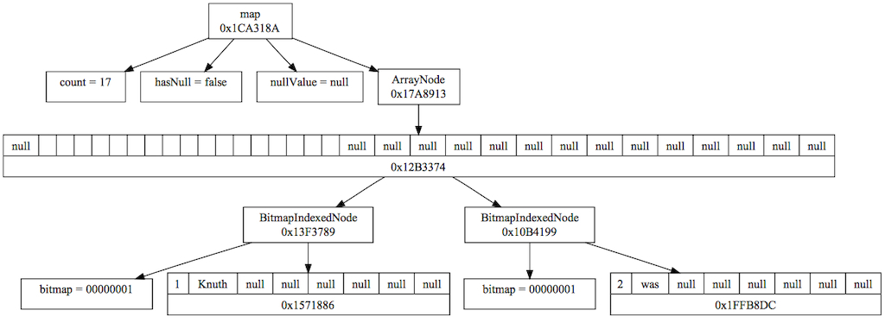
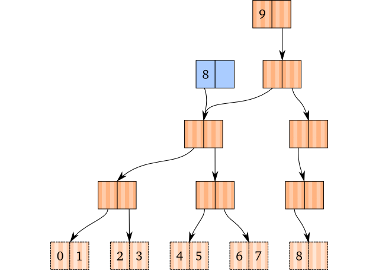

<!-- $theme: gaia
 template: gaia
 -->

# Data Structures: Part 1

---
<!-- page_number: true -->

## Immutable state

 
 
 
 

- Major difference between Clojure and all other dialects of Lisp

---

## Immutable state

 
 

#### What is it?
- Data is not modified
- So what happens when state is updated?
  - New data is created.
  - Old data still remains.

---

## Immutable state

 

##### Why?
- Makes program easier to reason about (static analysis)
- Reduces dependence between functions: more modularity + code reuse
- Shorter and more legible code == less bugs.
- Everything is threadsafe, allowing for implicit parallelism (no need for locks)

---

## Immutable state

&nbsp;&nbsp;&nbsp;&nbsp;&nbsp;&nbsp;&nbsp;&nbsp;&nbsp;&nbsp;&nbsp;&nbsp;&nbsp;&nbsp;&nbsp;&nbsp;&nbsp;&nbsp;&nbsp;

&nbsp;&nbsp;&nbsp;&nbsp; - Alan Kay, Lisp hacker and inventor of
&nbsp;&nbsp;&nbsp;&nbsp;&nbsp;&nbsp;&nbsp;Object-Oriented Programming

---

## Immutable state

#### Does it affect performance?
- The short answer: no!
- Garbage collection on the JVM is now highly optimized
- Memory usage is controlled by eliminating intermediate copies of data
  - In other languages as a compiler optimization (fusion)
  - In Clojure by not creating them in the first place (tranducers...more on this later)

---

## Immutable State

##### In Clojure immutability is encouraged, but not enforced.
- Functional programming avoids variable assignment
- Functions are referred to as "pure" or having "referential transparency" if:
  - No global state passed in
  - No local state
  - They cannot modify other parts of the program (referred to as "side effects")

---

 
 
 

- Pure functions are "idempotent"&mdash; applying multiple times to same input does nothing (like mathematical functions)
- Most built-in functions in Clojure are pure
- Impure functions end with a ! ("bang")

---

## The Collection Abstraction

> "It is better to have 100 functions operate on one data structure than 10 functions on 10 data structures."

&nbsp;&nbsp;&nbsp;&nbsp; - Alan Perlis, first recipient of the Turing Award

- Clojure extends the "list processing" paradigm to other data structures by abstracting over them with a consistent API

- All data structures implement the "Collection" abstraction ("coll" for short)

---

## The Collection Abstraction

 

Abstracing data structures based on shared APIs allows Clojure to optimize them under the hood.
- Even the same data structure may implement functions differently based on the number of elements
- It's often faster to implement higher order functions with Java methods than recursive Clojure functions.

---

- The Clojure compiler is a mix of Clojure and Java code, with APIs managed by Java interfaces
- Clojure encapsulates this using parametric polymorphism in the form of _protocols_ (covered later)
- It's important to understand what particular implementation is being used in order to write performant code, but more specific details are beyond the scope of this workshop
- If you're interested, there's a link to the source for every function in the cheatsheet. Don't be afraid, the Clojure compiler is very accessible!

---

## Types of Collections

 
 
 

### Lists

  - S-expresions starting with `list` or `quote`
  - Example: `'(1 2 3)`

---

## Types of Collections

 
 

### Vectors

  - Ordered, like lists but more performant
  - Square brackets
  - Example: `["foo" "bar" "baz"]`

---

## Types of Collections

 

### Maps
  - Associates keys with values
  - Unordered, except for `sorted-map` and `array-map`
  - Curly brackets
  - Example: `{:language "Clojure", :creator "Rich Hickey"}`

---

# Types of Collections

 

## Sets

  - Unordered
  - Elements can only appear once
  - Curly brackets preceded with hashtag
  - Example: `#{"clojure" "scheme" "haskell" "ocaml" "scala"}`
  - Not covered in this workshop

---

## Under the Hood

 

 All collections except for linked lists are "tries."

- Name comes from "retrieval"
- Officially pronounced like "tree," but commonly pronounced like "try" so as to avoid confusion
- Invented in 1959, but became popularized in Chris Okasaki's _Purely Functional Data Structures_ (1998)

---

 
 
 

- Trees with data _only_ stored in leaves
- Location in tree determines location (index or key) of value
- Grow dynamically when new values are added (preallocation unnecessary)

---

## Under the Hood: Maps & Sets

Maps and Sets are "hash array mapped tries" (HAMTs)

---

HAMTs

- Invented by Phil Bagwell in "Ideal Hash Trees" (2000) then implemented in Scala
- Optimized for immutable key-value storage
- As name implies, keys are hashed to ensure constant length
- _Most of the time_ faster for all common operations than hash-tables using buckets
- Lookup can often be done in constant time, although worst-case is linear

---

## Under the Hood: Vectors

Clojure vectors are 32-array binary search tries

---
 

Clojure Vectors

- Invented by Rich Hickey
- Binary structure means logarithmic time from root to leaf...
- ...except in this case each node has up to 32 children (unlike image above)...
- ...meaning log32 time, which is _effectively_ constant

---

 

- This makes large vectors extremely efficient, even into millions of elements
- Time complexity applies for most common operations: append, update, lookup, and taking subvectors
- However, _not_ for prepending: unlike lists, new elements go at the end
- Vectors make ideal stacks: `conj`, `pop`, `peek`

---

## Collection Functions

 
 

All collections share a basic API
- `=`: checks value equality of a collection compared to other collections
- `count`: returns number of elements in a collection
  - Takes linear time so use sparingly!

---

 
 

- `conj`: adds an item to a collection in the most efficient way (short for "conjoin")
  - Note: "most efficient" means in a different place for each collection type. Be careful!
- `empty`: returns an empty collection of the same type as the argument
- `seq`: gets a sequence of a collection

---

## How to Work With Lists, Vectors, and Maps Coming Up in Part II...
